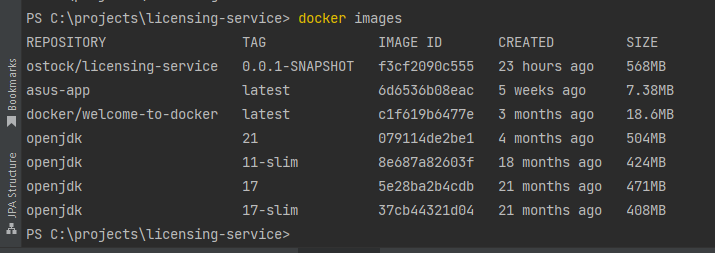

# Licensing server 

### Инструменты:

Java(21), Spring Boot(3.2.0).

### Создание образа:
Для создания образа проекта необходимо выполнить команду   
**mvn clean package**  
Далее необходимо выполнить команду  
**mvn package dockerfile:build**  
Для проверки существующих образов можно выполнить команду  
**docker images**  
, которая в таблице выведет существующие образы:  

Теперь можно развернуть и запустить полученный образ командой:  
**docker run f3cf2090c555**  
Также команде docker run можно передать параметр -d, чтобы за-
пустить контейнер в фоновом режиме, например:  
**docker run -d f3cf2090c555**  

Для запуска docker compose в корне проекта лежит файл docker-compose.yaml. Данный файл содержит параметры для создания и запуска контейнера, который содержить всё необходимое для работы. Для того чтобы запустить контейнер, необходим в командной строке написать команду:   
**docker-compose up**  

